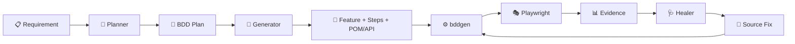
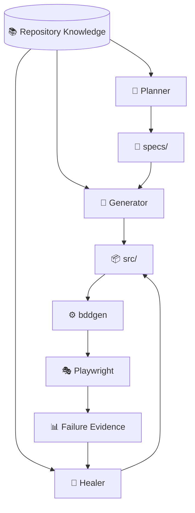
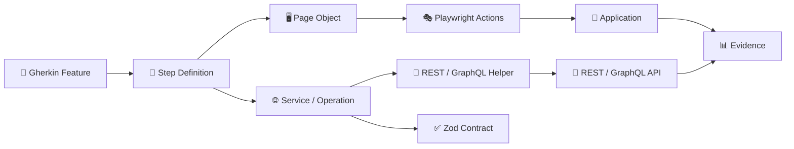
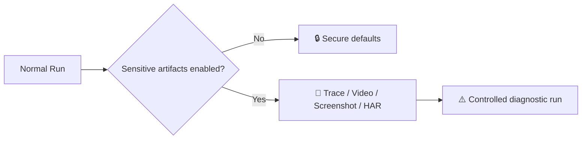
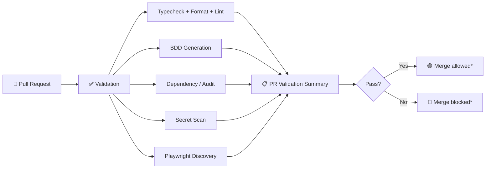
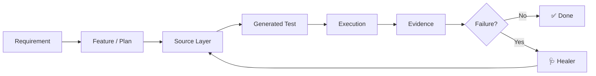

# AI-Assisted Playwright Quality Engineering Framework

<p align="center">
  <strong>BDD-first test automation + API testing + secure diagnostics + repository-aware AI agents</strong>
</p>

<p align="center">
  <a href="https://github.com/hexdee606/e2e-playwright-boilerplate-ts/actions">CI</a> •
  <a href="https://github.com/hexdee606/e2e-playwright-boilerplate-ts/tree/develop/.github/agents">AI Agents</a> •
  <a href="https://github.com/hexdee606/e2e-playwright-boilerplate-ts/tree/develop/docs">Knowledge Base</a> •
  <a href="https://github.com/hexdee606/e2e-playwright-boilerplate-ts/blob/develop/LICENSE">Apache-2.0</a>
</p>

<p align="center">
  
  
  
  
  
  
  
</p>

> **Source-first, AI-assisted Quality Engineering framework for Playwright + TypeScript.**
>
> The repository currently contains **7 Gherkin feature files and 16 committed BDD scenarios**, with UI, REST, GraphQL, mocking, contracts, secure diagnostics, CI validation, and three repository-aware AI agents.

---

## 🚀 What makes it different?

This is not just a Playwright test collection.



### The core loop

| Stage           | What happens                                                                                          |
| --------------- | ----------------------------------------------------------------------------------------------------- |
| 🧠 **Plan**     | Planner explores the application/API and creates a repository-aligned implementation plan.            |
| 🏗️ **Generate** | Generator creates the correct BDD + TypeScript layers.                                                |
| ▶️ **Execute**  | `bddgen` creates executable tests and Playwright runs them.                                           |
| 🔎 **Diagnose** | Traces, screenshots, logs, API evidence and reports help explain failures.                            |
| 🩺 **Heal**     | Healer investigates the failure, repairs the source layer, regenerates, and performs a focused rerun. |

> **AI assists the engineering workflow; it does not replace review or create an autonomous testing service.**

---

## 🤖 AI Quality Engineering Layer

Three specialized repository agents live under `.github/agents/`:



| Agent            | Primary job                                    | Output / action                                                     |
| ---------------- | ---------------------------------------------- | ------------------------------------------------------------------- |
| 🧭 **Planner**   | Understand behavior and repository conventions | BDD-oriented plans under `specs/`                                   |
| 🏗️ **Generator** | Implement approved scenarios                   | Features, steps, page/service layers, operations, models, contracts |
| 🩺 **Healer**    | Diagnose and repair failing scenarios          | Source repair → regenerate → focused rerun                          |

The agents use the repository's **Playwright MCP** integration and are configured around **Claude Sonnet 4.6**.

---

## 🏛️ Architecture



### Source ownership

```text
src/**/features/*.feature
        │
        ▼
step_definitions/*_steps.ts
        │
        ├───────────────┐
        ▼               ▼
Page Objects      Service Pages / Operations
        │               │
        ▼               ▼
PlaywrightActions  ApiHelper / GraphQLHelper
        │               │
        └───────┬───────┘
                ▼
          Application / APIs
                │
                ▼
        Contracts + Evidence
```

> `out/` is generated output. **Do not hand-edit generated tests.** Fix the source feature or TypeScript instead.

---

## 🧩 Capability map

| Area          | Capability                                            |
| ------------- | ----------------------------------------------------- |
| 🎭 Browser    | Playwright + Chromium                                 |
| 📝 BDD        | `playwright-bdd` + Gherkin                            |
| 🖥️ UI         | Page Objects + shared browser actions                 |
| 🌐 REST       | `ApiHelper`                                           |
| 🔗 GraphQL    | `GraphQLHelper` + reusable operations                 |
| 🎯 Mocking    | UI, REST and GraphQL route mocking                    |
| ✅ Contracts  | Zod response validation                               |
| 🔐 Security   | Redaction + secure input + opt-in sensitive artifacts |
| 📊 Reporting  | Allure + Monocart + Playwright logging                |
| 🤖 AI         | Planner + Generator + Healer                          |
| 🧠 AI Context | Knowledge base + runtime agent context                |
| 🧩 MCP        | Playwright MCP for browser exploration/debugging      |
| ⚙️ CI         | PR validation + manual regression workflow            |

---

## 🧪 Current example coverage

The boilerplate currently includes **7 feature files / 16 scenarios** covering:

```text
🖥️ UI
├── Date-picker workflow
├── Iframe workflow
├── UI component mocking
└── Sensitive-input / security behavior

🌐 API
├── REST success + mocked failure
├── GraphQL query + mutation
└── GraphQL mocking

✅ Contracts
└── Zod response-shape validation
```

These are representative framework examples, not a claim of broad application-domain coverage.

---

## 🔐 Security by default

Sensitive diagnostics are **opt-in**.



The framework includes:

- 🔒 Sensitive-input helpers for passwords, tokens, OTPs and personal/critical values
- 🧹 Redaction of common credentials, cookies, secrets, tokens and API keys
- 🚫 Sensitive traces/video/screenshots/HAR disabled by default
- 🛡️ Explicit opt-in for unsafe Chromium flags in controlled environments
- 🔎 Post-run report secret scanning

Useful controls:

```bash
E2E_CAPTURE_SENSITIVE_ARTIFACTS=true
E2E_VERBOSE=true
E2E_ALLOW_UNSAFE_CHROMIUM=true
```

> Do not commit real credentials, secrets, reports, traces, screenshots, videos, HAR files, or downloaded sensitive data.

---

## ⚙️ CI / GitHub Actions

### Pull Request validation



`pull-request-validation.yml` runs automatically for PR updates.

> \*To actually block merging, configure GitHub branch protection/rulesets to require the **`PR Validation Summary`** status check.

### Manual regression

`poc-regression-suite.yml` is intentionally **manual-only** to avoid spending GitHub Actions minutes on every push/PR.

```text
🎯 Select suite
   ├── all
   ├── suit1
   ├── suit2
   └── suit3
        │
        ▼
   BDD generation
        │
        ▼
   Playwright execution
        │
        ▼
   Reports / artifacts
```

---

## 📁 Repository map

```text
configs/              🌍 Environment configuration
settings/             ⚙️ Runtime + BDD configuration
src/frontend/         🖥️ UI features / steps / pages
src/backend/          🌐 REST / GraphQL features / services / contracts
utilities/             🧰 Helpers / mocking / diagnostics / agent memory
docs/knowledge...     📚 Repository knowledge
.github/agents/       🤖 Planner / Generator / Healer
.github/workflows/    ⚙️ PR + manual CI
specs/                 📝 BDD implementation plans
out/                   📦 Generated runtime output
```

---

## 🛠️ Tech stack

```text
                 ┌────────────────────────────┐
                 │  AI Quality Engineering    │
                 │ Planner • Generator • Heal │
                 └─────────────┬──────────────┘
                               │
             ┌─────────────────▼─────────────────┐
             │  Playwright + playwright-bdd      │
             └───────┬─────────────┬─────────────┘
                     │             │
             ┌───────▼──────┐ ┌────▼──────────┐
             │ UI Automation│ │ API Testing   │
             │ Page Objects │ │ REST + GraphQL│
             └───────┬──────┘ └────┬──────────┘
                     │             │
                     └──────┬──────┘
                            ▼
                    ┌───────────────┐
                    │ Zod Contracts │
                    └───────┬───────┘
                            ▼
                    📊 Reports + Evidence
```

**Core stack:** Playwright · TypeScript · ESM · `playwright-bdd` · Gherkin · Node.js · Zod · Allure · Monocart · GitHub Actions · Playwright MCP

---

## 🚦 Quick start

### 1. Install

```bash
git clone https://github.com/hexdee606/e2e-playwright-boilerplate-ts.git
cd e2e-playwright-boilerplate-ts
npm ci
npx playwright install chromium
```

For CI/Linux environments:

```bash
npm run setup
```

### 2. Generate BDD tests

```bash
npm run test:generate-bdd
```

### 3. Run everything

```bash
npm run test:e2e
```

### 4. Run one suite

```bash
npm run test:generate-bdd
npx playwright test --project=suit1
```

Available projects:

`@suit1` · `@suit2` · `@suit3`

---

## 📋 Common commands

| Command                         | Purpose                                                           |
| ------------------------------- | ----------------------------------------------------------------- |
| `npm run setup`                 | Install dependencies and Playwright browsers with OS dependencies |
| `npm run typecheck`             | Strict TypeScript validation                                      |
| `npm run audit`                 | High-severity npm audit validation                                |
| `npm run test:generate-bdd`     | Generate executable tests                                         |
| `npm run test:e2e`              | Generate + execute the full suite + report secret scan            |
| `npm run test:debug`            | Debug `suit1`                                                     |
| `npm run test:smoke`            | Run `@suit1` scenarios                                            |
| `npm run report:allure-serve`   | Serve Allure results                                              |
| `npm run report:monocart-serve` | Serve Monocart results                                            |

---

## 🌍 Environment configuration

The default environment is `int`.

```bash
E2E=int npm run test:e2e
```

Endpoint overrides are supported without changing test code:

```bash
E2E=int \
E2E_FRONTEND_URL=https://frontend.example.test \
E2E_API_URL=https://api.example.test \
E2E_GQL_URL=https://graphql.example.test/api \
npm run test:e2e
```

---

## 🧠 Repository-aware engineering rules

The framework intentionally keeps both humans and AI agents inside the same architecture:



### Rules that matter

- ✅ Keep feature language business-readable.
- ✅ Keep selectors in page objects.
- ✅ Keep browser mechanics in shared actions.
- ✅ Keep API transport behind the shared helpers.
- ✅ Validate important responses with Zod contracts.
- ❌ Do not hand-edit `out/tests`.
- ❌ Do not hide failures with `test.fixme()` / skips.
- ❌ Do not use arbitrary sleeps or `networkidle` to mask synchronization issues.
- ✅ A healer change should be proven with a focused rerun.

---

## 📊 Why this is useful

```text
Traditional Playwright

Write → Run → Fail → Debug → Fix

This framework

Plan → Generate → Run → Diagnose → Heal → Rerun
  ↑___________________________________________↓
             Repository knowledge
```

The main value is the **engineering system around the tests**: consistent source ownership, reusable UI/API abstractions, contracts, diagnostics, secure defaults, CI governance, and agent-assisted workflows.

---

## ⚠️ Current limitations

- Included live examples use public/demo services and should not be treated as an enterprise test environment.
- AI agents depend on a compatible Copilot/agent host and the configured Playwright MCP tooling.
- Shared browser-action/state patterns require care when extending parallel execution.
- The AI layer is repository-aware assistance, **not an embedded autonomous AI service**.

---

## 🌟 Project positioning

> **AI-assisted Quality Engineering with Playwright — from requirement to BDD, execution, diagnostics, and healing.**

The framework brings together:

**BDD** + **UI automation** + **REST/GraphQL** + **contracts** + **mocking** + **secure diagnostics** + **CI governance** + **AI agents**

---

## 📄 License

Apache-2.0 — see [LICENSE](LICENSE).

<p align="center">
  <sub>Built for practical QA automation, Quality Engineering, and repository-aware AI-assisted testing.</sub>
</p>
